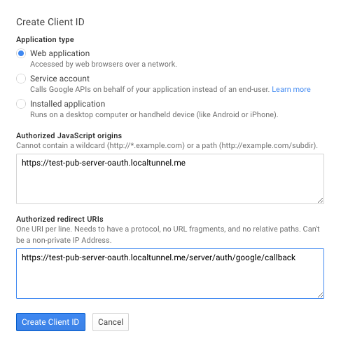
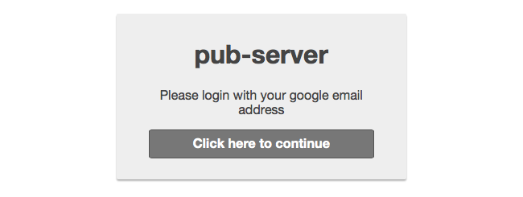
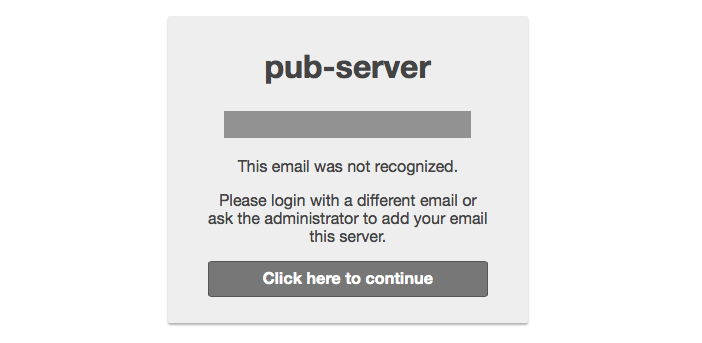

# pub-pkg-google-oauth

### installation
This package is included with pub-server. It can be activated by including it as a theme on the command line or in `pub-config`.

```sh
pub -t pub-pkg-google-oauth
```

### credentials
pub-pkg-google-oauth requires the client ID and a client secret to be specified as environment variables `GCID` and `GCS` respectively.

```sh
export GCID={client_ID}
export GCS={client_secret}
```

### configuring your app URL endpoint
oauth requires an endpoint for the protocol to redirect to after authenticating. In addition, google will not allow
a site to authenticate with oauth unless the site has been registered as a "javascript origin".

If you are using heroku, you can use your heroku app URL for this.

If you are running on your own machine over a local area network (or on wifi), you will need to configure a
tunnel service like [localtunnel](https://localtunnel.github.io/www/) or [ngrok](https://ngrok.com/) so that
your server can be reached from the Internet.

```sh
npm install -g localtunnel
lt --port 3001 --subdomain {yourname}
```

In either case, once you know your app URL, you can configure pub-server and pub-pkg-google-auth to use it by
setting the `APP` environment variable. E.g.

```sh
export APP=https://{yourname}.localtunnel.me
```

### oauth configuration on google

- use the [google developers console](https://console.developers.google.com/) and create project if you don't already have one
- under `Credentials`, create a new Client ID (type Web Application)
- set the `Javascript origin` to match your app URL
- set the `Redirect URI` to `{your app url}/server/auth/google/callback`
  
- note the new Client ID and Client secret


### configuring google email addressses to access pub-server
ACLs are configured using environment variables `ACL_ADMIN`, `ACL_EDIT`, and `ACL_READ`.
These contain comma-separated lists of users.

E.g. To grant yourself admin rights, and 3 other users read access:

```sh
export ACL_ADMIN={your-email}
export ACL_READ={email-1},{email-2},{email-3}
```

You can also open public/anonymous access to non-protected pages by running `pub -P` or setting `opts.publicPages`

### to test locally
- make sure you have set environment variables `GCID`, `GCS`, `APP`, and `ACL_ADMIN` (or some other `ACL_`)
- start localtunnel or similar service
- start pub-server with google oauth

```sh
$ pub -t pub-pkg-google-oauth
```

- now point your browser to https://{yourname}.localtunnel.me
- when running with auth, the default behavior is to require authentication for all pages

- you should see a login prompt
  

- this will be followed by the google oauth confirmation
  

- if all is well you will then be able to read the markdown page in the directory where `pub` was launched.
- if you have not configured the access properly for this email you will see another login prompt
  

### to disable auth even when this module is included

Set environment variable DISABLE_AUTH to run pub-server without authentication when this package is included.

# credits
- the heavy lifting in this package is done by
  [passport](https://github.com/jaredhanson/passport) and
  [passport-google-oauth](https://github.com/jaredhanson/passport-google-oauth)
